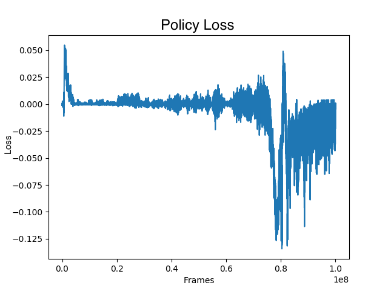
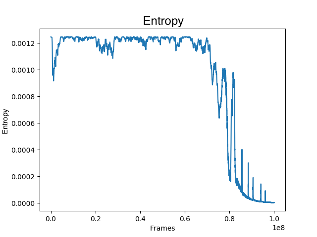

# Meta Bandits
### Apr 15, 2018

## Description
Minimal recreation of the Botvinick paper [Learning to Reinforcement Learn](https://arxiv.org/abs/1611.05763) using A2C.

This project seeks to train an RNN that posesses the ability to learn without plasticity (without changing the weights). The approach is an artificial simulation of an experiment done with monkeys. 

The experiment consisted of a monkey given the choice of uncovering one of two different colored cups. Beneath one of the two cups is a reward in the form of some tastey food. An episode within the experiment consisted of 10 trials. Each trial consisted of the same monkey allowed to pick between the two choices. For the entire trial, the food was always located under the same colored cup. Between each trial one of the two colored cups was chosen as the new color to have the food under it. 

The results were that the monkeys learned to consistenly pick the reward giving cup after the first step in the trial (in which the monkey had a 50-50 chance of selecting the reward cup). 

This is the experiment that this project seeks to emulate with a Recurrent Neural Network. The goal is to create an RNN that can leverage its past experience to pick the reward giving cup with minimal regret.

## Experimental Setup
For every step in a trial, the RNN is made to select one of 2 cups. One of the two cups provides a +1 reward with probability p. The other cup has probability (1-p) of containing the food. At every step, one of the two cups is guaranteed to provide a +1 reward. The other provides a reward of 0. The input to the RNN is the action taken at the last step along with the reward received at the last step. The hidden state is not reset until the end of a trial. A GRU is the RNN used for the experiment.

During the training stage, the RNN is trained using A2C to maximize the expected reward over trials. During the evaluation phase, no parameter updates are performed. During this stage the RNN operates over a trial with the same duration as that in which it was trained on. 

## Results
The following figures were created using a probability of 1.0 for the cup of choice (the simplest setting).

### Training 
One important aspect of this experiment is that it should be highly improbable to get 100% of the possible rewards. The maximum achievable reward accumulation should be 97.5% of the possible rewards, given 20 time steps in a trial and a 100% chance of the reward being under the same cup throughout the duration of a single trial. The 97.5% is because no information is given as to which cup holds the reward in the first time step. Following the first time step, the location of the reward is known, and as such, the agent can capitalize on the known cup. Keeping this in mind, we expect the average reward for each time step to approach 0.975 given that a reward of 0 or 1 is available at each time step. See **Figure 1**. 

**Figure 1.** The moving average of the reward at each timestep collected over the past 100 timesteps during training.
-----------------------------

**Figure 2.** Global loss includes the actor, critic, and entropy terms of the A2C loss function.
----------------------------

**Figure 3.** Policy gradient loss.
----------------------------

**Figure 4.** Critic loss (a.k.a. Value function loss).
----------------------------

**Figure 5.** Entropy
----------------------------

## Evaluation
The evaluation stage consisted of running the trained RNN without changing the parameters of the network. The evaluation was performed on 100 trials, each with 20 time steps. We expect to see close to a 50% expected reward at the first time step followed by 100% expected reward.

**Figure 6.** The reward collected at each timestep averaged over 100 trials. 
----------------------------
